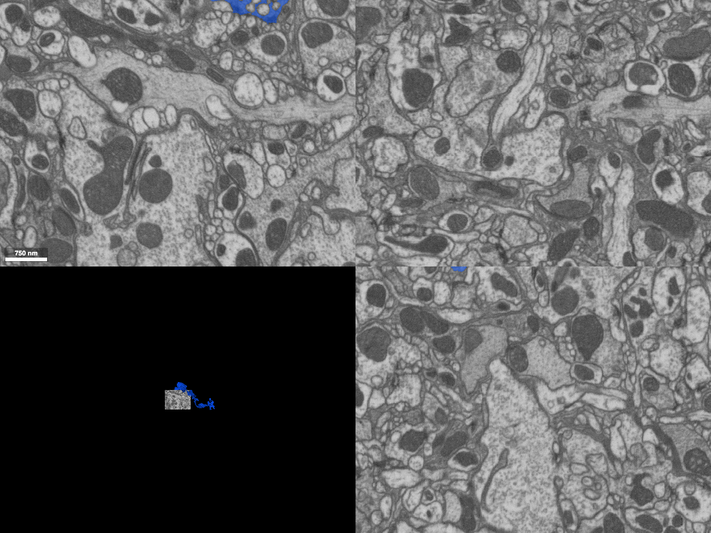

# ngsnap

Turn a Neuroglancer state (a link or a JSON state) into a consistently styled static PNG,
headlessly and reproducibly. 

Use it in CI, a paper, a talk, or a blog build.

## The default house style

ngsnap applies its own look to a render rather than trusting whatever the input link happened
to look like. `Spec.default()` is the single opinionated default:

- **Chrome off:** hides Neuroglancer's UI controls and panel borders.
- **Fixed size:** renders at 1600×1200 so figures are uniform.
- **Neutral background:** black cross-section and projection backgrounds.
- **Scale bar on:** shown at its natural size.
- **Respects the author:** per-layer visibility and selected segments, the position, and the
  cross-section/projection zoom are left as the state specifies.

The example below is a 4-panel view (2D EM cross-sections plus a 3D mesh) of public FIB-25 data,
rendered with `Spec.default()`:



Regenerate it with `just readme-example` (see [scripts/render_readme_example.py](scripts/render_readme_example.py)).

## Python API

> **Target API.** This section describes the intended shape of the public API. Lines
> marked `# planned` are not implemented yet; everything else works today. It exists so
> we can agree on the surface before filling in the gaps.

A `Spec` is the unit of reuse: a named, frozen set of state properties you can **apply**
to make links uniform, **check** links against, and **extract** from a link you already
like. It starts out as appearance (the house style) but can pin any part of a state —
sources, selection, camera — so nothing here is limited to "looks." Rendering is a
separate step that takes a spec.

```python
# the link you are starting with
link = "https://neuroglancer-demo.appspot.com/#!..."
```

### Specs

```python
from ngsnap import Spec

spec = Spec.default()                      # opinionated house style
spec = Spec.from_file("my_spec.toml")

# Generate a new spec FROM a link by lifting a named setting group out of it.
spec = Spec.from_state(link, groups=["appearance"])   # planned
spec.to_file("my_spec.toml")                        # planned — round-trips with from_file
```

### Apply a spec — restyle a link or state

`apply` takes a source and a spec — a `Spec`, or a plain dict / TOML path as an anonymous
spec — and returns the restyled result in the **same shape as the input**: a link in
gives a link out, a JSON state in gives a JSON state out. No new class to reason about.

```python
from ngsnap import apply, REMOVE

apply(link, spec)                          # link in -> restyled link out (host prefix preserved)
apply(state, spec)                         # JSON state in -> restyled JSON state out

apply(link, {"showAxisLines": False, "layers": {"seg": {"visible": True}}})  # anonymous spec
apply(link, {"crossSectionScale": REMOVE})   # delete a key
```

`apply` never touches a browser, so it is cheap and usable purely to produce restyled
links or states. The state is inlined in the URL fragment — ngsnap never uploads a new
state or mints a short link.

### Check a spec — does a link already match?

`check` is the read-only counterpart of `apply`: instead of restyling, it reports whether
a source already matches the spec. It returns a report that is itself truthy, so it reads
like a bool but still carries the details of what diverged.

```python
from ngsnap import check

report = check(link, spec)                 # planned -> SpecReport
if report:                                 # truthy when the state already matches
    ...
report.ok                                  # the same bool, explicitly
report.mismatches                          # {property: (expected, actual)} for what diverges
```

Checking is strict: a property matches only when it is explicitly present and equal, so
applying a spec and then checking against it always passes.

### Render a link with a spec

```python
from ngsnap import render

render(link, "fig.png", spec=spec)         # link -> PNG, applying the spec
```

### Authenticated sources

Private states and data sources resolve with credentials read from the environment —
never baked in or written to disk (planned; needs the optional `cave` extra for
`caveclient`, `uv sync --extra cave`).

### Cache keys

```python
from ngsnap import cache_key

key = cache_key(link, spec)                # planned — stable string over state + spec (P7)
```

Callers own the cache; `cache_key` just gives a deterministic key so unchanged
inputs can skip rendering an image that should not have changed.

## CLI

> **Target API.** The CLI is a thin wrapper over the Python API above and does not exist
> yet; this is the intended command surface.

```
# Render a link to a PNG with a spec.
ngsnap render <url-or-file> -o fig.png [--spec s.toml] [--timeout 60]

# Apply a spec file or inline --set overrides; print the restyled link or JSON.
ngsnap apply <url-or-file> [--spec s.toml] [--set key=value]... [--url | --json]

# Check whether a link conforms to a spec; exit non-zero if it diverges.
ngsnap check <url-or-file> [--spec s.toml] [--strict]

# Extract a named setting group from a link into a spec; prints TOML.
ngsnap extract <url-or-file> [--group appearance]

# Stable cache key over state + spec.
ngsnap cache-key <url-or-file> [--spec s.toml]
```

Every command reads a link, a JSON file, or `-` for JSON on stdin and writes to stdout —
except `render`, which writes a PNG to `-o` — so the tool composes in shell pipelines and
site builds.

## Installation

The render engine needs the `render` extra (pinned Chrome for Testing via Selenium):

```
uv sync --extra render      # or: pip install "ngsnap[render]"
```

Selenium Manager downloads the pinned Chrome-for-Testing build on first render, so no
system Chrome is required. To provision it ahead of time (one step, no `apt`, no `xvfb`):

```
just install-browser
# or: uv run python -c "from ngsnap.render import install_browser; install_browser()"
```

- **CI (`ubuntu-latest`):** `uv sync --extra render` then the provision command above. The
  runner already has the shared libraries Chrome needs; the render engine runs headless with
  software WebGL2 (no GPU, no display).
- **Local macOS (Apple Silicon):** identical — Selenium Manager fetches the `mac-arm64`
  Chrome-for-Testing build, so local renders match CI.

Define your own spec by copying [src/ngsnap/styles/default.toml](src/ngsnap/styles/default.toml)
and pointing `Spec.from_file(...)` at it.
